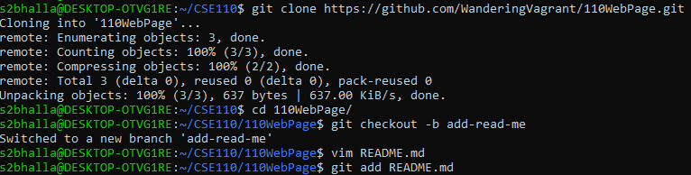

# About Me  
*Sahil Bhalla*  
I am a physics, cs, and math student at UCSD.

>Sahil Bhalla  

I used commands in the terminal to make this webpage such as
`git commit` 

I used [this](https://docs.github.com/en/github/writing-on-github/basic-writing-and-formatting-syntax#headings) to build this site

[An example of these commands being used](screenshots/1.1.png)  

If that link didn't work here's the image directly:  
  

Three programming languages I know in no particular order
- C++
- Python
- Java

Three Important Classes I've taken in order of least recent to most
1. Advanced Data Structures
2. Algorithms
3. Programming Languages
 
- [ ] website done?
- [x] website done. 

[This goes to the heading](#about-me)  
